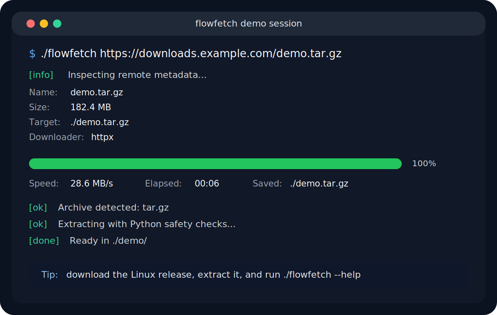
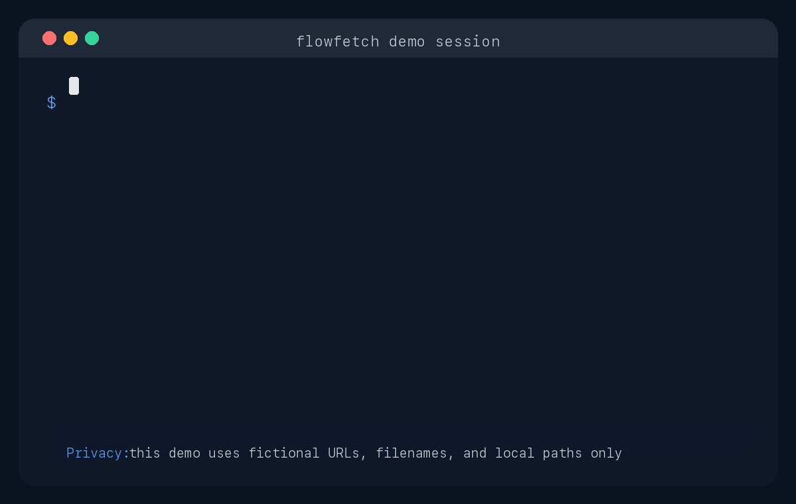

<div align="center">
  <h1>FlowFetch</h1>
  <p><strong>Linux-first CLI downloader for direct file URLs.</strong></p>
  <p>Validate links, stream downloads with progress, and safely extract common archives from a single command.</p>
  <p>
    <a href="README.zh-CN.md">简体中文</a> •
    <a href="https://github.com/MRT-8/FlowFetch/releases">Releases</a> •
    <a href="https://github.com/MRT-8/FlowFetch/releases/latest">Latest Binary</a>
  </p>
  <p>
    <a href="https://github.com/MRT-8/FlowFetch/releases">
      
    </a>
    <a href="https://github.com/MRT-8/FlowFetch/actions/workflows/release.yml">
      
    </a>
    <a href="LICENSE">
      
    </a>
    
    
  </p>
</div>

[Quick Start](#quick-start) • [Release Package](#use-the-linux-release-package) • [Source Workflow](#run-from-source) • [Examples](#common-examples) • [Release Notes](#release-notes)

> [!TIP]
> End users should start with the GitHub Release package. Download `flowfetch-linux-x86_64.tar.gz`, extract it, and run `./flowfetch` without installing Python or running `pip install`.

## Preview



## Sanitized Demo

<p align="center">
  
</p>

This animation is generated from a scripted scene with fictional URLs, filenames, and local paths only. It is intentionally not a screen recording from a real machine.

## Why FlowFetch

FlowFetch is built for the common "paste a file URL and get the result locally" workflow, without turning a simple download into a setup project.

| Need | What FlowFetch does |
| --- | --- |
| Direct file downloads | Accepts `http://` and `https://` URLs and validates them before download |
| Clean terminal feedback | Shows filename, size, progress, speed, and ETA |
| Safer file handling | Writes to `.part` first, validates, then renames into place |
| Archive-friendly flow | Detects common archive formats and can extract them safely |
| Scriptable behavior | Uses stable exit codes and explicit CLI options |
| Flexible fallback path | Can switch to `curl`, `wget`, `tar`, `unzip`, `gzip`, and `7z` when needed |

## Quick Start

| Workflow | Best for | Python required | First step |
| --- | --- | --- | --- |
| Release package | End users who want a ready-to-run binary | No | Download the latest `flowfetch-linux-x86_64.tar.gz` from Releases |
| `uv` source workflow | Contributors and users running from source | Yes | `uv sync` |
| `pip` source workflow | Compatibility with a plain Python environment | Yes | `pip install -r requirements.txt` |

## Use the Linux Release Package

This is the recommended path if you want the packaged binary instead of a source checkout.

1. Download the latest `flowfetch-linux-x86_64.tar.gz` from [GitHub Releases](https://github.com/MRT-8/FlowFetch/releases/latest).
2. Extract the archive and enter the folder.
3. Run `flowfetch` directly, or install it system-wide.

Run it directly:

```bash
tar -xzf flowfetch-linux-x86_64.tar.gz
cd flowfetch-linux-x86_64
chmod +x flowfetch
./flowfetch --help
./flowfetch https://example.com/demo.zip
```

Optional system-wide install:

```bash
sudo install -m 0755 flowfetch /usr/local/bin/flowfetch
flowfetch --help
flowfetch https://example.com/demo.zip
```

> [!NOTE]
> The release package contains a single Linux `x86_64` executable plus `LICENSE` and a short `README.txt`. It does not require Python, `uv`, or `pip install`.

## Run From Source

Preferred `uv` workflow:

```bash
uv sync
uv run flowfetch --help
uv run flowfetch https://example.com/demo.zip
```

Direct script entrypoint:

```bash
uv run downloader.py --help
python downloader.py https://example.com/demo.zip
```

Plain `pip` fallback:

```bash
pip install -r requirements.txt
python downloader.py --help
```

## Common Examples

Download a file:

```bash
flowfetch https://example.com/demo.zip
```

Download to a custom directory and extract automatically:

```bash
flowfetch --output-dir ./downloads --extract https://example.com/demo.tar.gz
```

Force the Python downloader:

```bash
flowfetch --downloader httpx https://example.com/file.bin
```

Force the system extractor:

```bash
flowfetch --extractor system --extract https://example.com/demo.7z
```

Run in interactive mode:

```bash
flowfetch
```

## Key CLI Options

```bash
flowfetch [options] [url]
```

- `-o, --output-dir`: target download directory
- `--filename`: force the saved filename
- `--downloader auto|httpx|curl|wget`: choose the downloader
- `--extractor auto|python|system`: choose the extraction strategy
- `--extract`: always extract archives after download
- `--no-extract`: never extract archives after download
- `--overwrite`: allow overwriting existing targets
- `--rename`: auto-rename conflicts
- `--download-threshold`: downloader switch threshold such as `1g`
- `--extract-threshold`: extractor switch threshold
- `--retry`: number of download retries
- `--timeout`: shared connect/read timeout
- `--keep-partial`: keep `.part` files on failure
- `--delete-partial`: remove `.part` files on failure
- `--no-fallback`: disable automatic fallback paths
- `--yes`: accept recommended prompts automatically
- `--verbose`: print more detailed error information

## How FlowFetch Behaves

- It probes metadata before downloading when possible so it can show a filename and expected size.
- Downloads are written to a `.part` file first, then renamed after validation succeeds.
- Small and normal-sized files use the Python downloader by default.
- Very large files can switch to `curl` or `wget` when available.
- Supported archives use Python extraction by default, with safety checks against path traversal.
- Unsupported or large archive cases can use system extractors when available.

<details>
<summary><strong>Supported Formats</strong></summary>

Python standard library extraction currently supports:

- `zip`
- `tar`
- `tar.gz`
- `tgz`
- `tar.bz2`
- `tar.xz`
- `gz`

Enhanced support via system tools:

- `7z` with `7z` or `7zz`

</details>

<details>
<summary><strong>Optional System Tools</strong></summary>

FlowFetch does not require system tools for its default path, but it can use them as an enhancement when:

- a file is large enough to trigger downloader switching
- a format is better handled by system extractors
- the Python path fails and fallback is allowed

Useful tools:

- `curl`
- `wget`
- `unzip`
- `tar`
- `gzip`
- `7z` or `7zz`

Common Linux install examples:

```bash
# Debian / Ubuntu
sudo apt update && sudo apt install -y curl wget unzip tar gzip p7zip-full

# CentOS / RHEL
sudo yum install -y curl wget unzip tar gzip p7zip p7zip-plugins

# Fedora
sudo dnf install -y curl wget unzip tar gzip p7zip p7zip-plugins

# Arch Linux
sudo pacman -S curl wget unzip tar gzip p7zip
```

</details>

<details>
<summary><strong>Exit Codes</strong></summary>

- `0`: success
- `2`: invalid arguments
- `3`: user cancelled
- `4`: invalid URL
- `5`: metadata fetch failed
- `6`: download failed
- `7`: downloaded file validation failed
- `8`: extraction failed
- `9`: missing system downloader
- `10`: missing system extractor
- `11`: unsupported format
- `12`: permission denied

</details>

## Release Notes

- [`release/v0.1.0.md`](release/v0.1.0.md)
- [GitHub Release v0.1.0](https://github.com/MRT-8/FlowFetch/releases/tag/v0.1.0)

## Repository Layout

- `downloader.py`: current CLI entrypoint and main implementation
- `pyproject.toml`: project metadata and `flowfetch` console entrypoint
- `uv.lock`: locked runtime dependency set for the `uv` workflow
- `requirements.txt`: lightweight `pip` dependency list
- `assets/flowfetch-terminal.svg`: terminal-style preview image used in the repository and release notes
- `assets/flowfetch-demo.gif`: sanitized animated terminal demo for the GitHub README
- `assets/social-preview.png`: GitHub social preview image prepared for manual upload in repository settings
- `flowfetch.spec`: PyInstaller spec for the Linux single-file build
- `release/README.txt`: short instructions bundled with the binary package
- `release/v0.1.0.md`: notes for the first public GitHub Release
- `README.md`: English project documentation
- `README.zh-CN.md`: Simplified Chinese project documentation
- `scripts/generate_demo_gif.py`: script that regenerates the sanitized demo GIF
- `scripts/generate_social_preview.py`: script that regenerates the social preview PNG

## License

This project is licensed under the Apache License 2.0. See [LICENSE](LICENSE).
